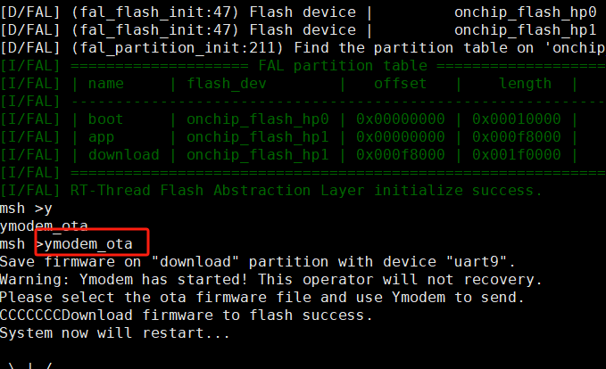
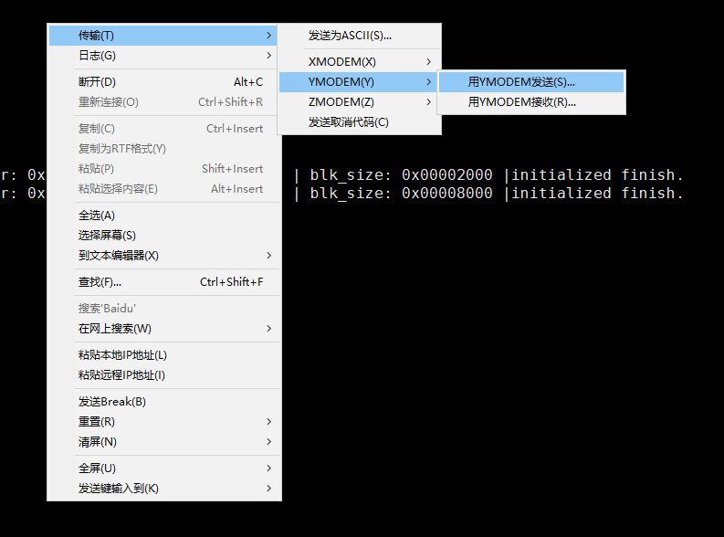

# OTA APP 例程

## 简介

- 本文档为 OTA 升级的 APP 工程说明。通过运行当前示例工程，可以学习如何利用 OTA 功能给开发板升级固件。**注：当前例程需配合 boot 例程才能正常运行。**查看本例程之前，请先查看 ota-boot 例程的 README 文档。

## 使用说明

- 本 SDK 可以从 studio 的 SDK 管理界面直接下载，并基于本 SDK 新建当前示例工程。

下载程序成功之后，系统会自动运行并打印系统信息。

连接开发板对应串口到 PC , 在终端工具里打开相应的串口（115200-8-1-N），复位设备后，可以看到 RT-Thread 的输出信息。输入 help 命令可查看系统中支持的命令。

```bash
[E/Qboot] Qboot verify fail. firmware infomation check fail.
[E/Qboot] Qboot firmware update fail. destination partition verify fail.
Erasing download partition ... 
Qboot delete firmware success.
Jump to application running ... 
 \ | /
- RT -     Thread Operating System
 / | \     5.0.1 build Oct 27 2023 15:13:38
 2006 - 2022 Copyright by RT-Thread team

Hello RT-Thread at app!
[D/FAL] (fal_flash_init:47) Flash device |         onchip_flash_hp0 | addr: 0x00000000 | len: 0x00010000 | blk_size: 0x00002000 |initialized finish.
[D/FAL] (fal_flash_init:47) Flash device |         onchip_flash_hp1 | addr: 0x00010000 | len: 0x001f0000 | blk_size: 0x00008000 |initialized finish.
[D/FAL] (fal_partition_init:211) Find the partition table on 'onchip_flash_hp0' offset @0x0000b374.
[I/FAL] ==================== FAL partition table ====================
[I/FAL] | name     | flash_dev        |   offset   |    length  |
[I/FAL] -------------------------------------------------------------
[I/FAL] | boot     | onchip_flash_hp0 | 0x00000000 | 0x00010000 |
[I/FAL] | app      | onchip_flash_hp1 | 0x00000000 | 0x000f8000 |
[I/FAL] | download | onchip_flash_hp1 | 0x000f8000 | 0x001f0000 |
[I/FAL] =============================================================
[I/FAL] RT-Thread Flash Abstraction Layer initialize success.
msh >
```

此工程自带了 ymodem_ota 命令，可配合支持 ymodem 协议的终端工具，发送升级包到系统。





boot进入之后会自动检测download分区的待升级固件，并自动更新到app分区，完成升级。

> 1. 出现 Qboot verify fail. firmware infomation check fail. 这个日志不用管，ota 功能正常即可。

## 联系人信息

在使用过程中若您有任何的想法和建议，建议您通过以下方式来联系到我们  [RT-Thread 社区论坛](https://club.rt-thread.org/)

## SDK 仓库

这是 HMI-Board 的 SDK 仓库地址：[sdk-bsp-ra6m3-hmi-board](https://github.com/RT-Thread-Studio/sdk-bsp-ra6m3-hmi-board)，该仓库包括了外设驱动以及丰富的示例工程，如果像体验官网/社区提供的开源示例请转移到该仓库进行开发。RT-Thread 主仓库只维护最新的驱动相关代码。

## 贡献代码

如果您对  RA6M3-HMI-Board 感兴趣，并且有一些好玩的项目愿意与大家分享的话欢迎给我们贡献代码，您可以参考 [如何向 RT-Thread 代码贡献](https://www.rt-thread.org/document/site/#/rt-thread-version/rt-thread-standard/development-guide/github/github)。