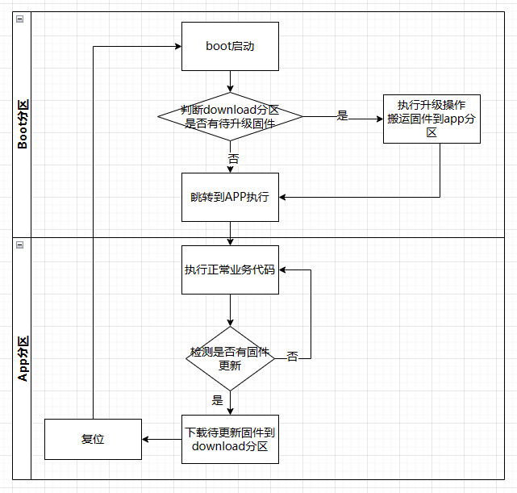

# OTA Boot 例程

## 简介

本文档为 OTA 升级的 Boot 工程说明。通过运行当前示例工程，可以学习如何利用 OTA 功能给开发板升级固件。当前例程使用 qboot 软件包，完成升级业务。

> 烧录此工程之后，可配合APP示例工程，体验OTA升级功能，或按照下方制作APP的教程，自己制作可升级的APP。

## 使用说明

- 本 SDK 可以从 studio 的 SDK 管理界面直接下载，并基于本 SDK 新建当前示例工程。

下载程序成功之后，系统会自动运行并打印系统信息。

连接开发板对应串口到 PC , 在终端工具里打开相应的串口（115200-8-1-N），复位设备后，可以看到 RT-Thread 的输出信息。输入 help 命令可查看系统中支持的命令。

```bash
 \ | /
- RT -     Thread Operating System
 / | \     5.0.1 build Oct 20 2023 18:29:17
 2006 - 2022 Copyright by RT-Thread team
msh >
Qboot startup ...
Qboot version   : V1.0.5 2020.10.05
[D/FAL] (fal_flash_init:47) Flash device |         onchip_flash_hp0 | addr: 0x00000000 | len: 0x00010000 | blk_size: 0x00002000 |initialized finish.
[D/FAL] (fal_flash_init:47) Flash device |         onchip_flash_hp1 | addr: 0x00010000 | len: 0x001f0000 | blk_size: 0x00008000 |initialized finish.
[I/FAL] ==================== FAL partition table ====================
[I/FAL] | name     | flash_dev        |   offset   |    length  |
[I/FAL] -------------------------------------------------------------
[I/FAL] | boot     | onchip_flash_hp0 | 0x00000000 | 0x00010000 |
[I/FAL] | app      | onchip_flash_hp1 | 0x00000000 | 0x000f8000 |
[I/FAL] | download | onchip_flash_hp1 | 0x000f8000 | 0x001f0000 |
[I/FAL] =============================================================
[I/FAL] RT-Thread Flash Abstraction Layer initialize success.
Press [Enter] key into shell in 1 s :
[E/Qboot] Qboot firmware check fail. firmware infomation check fail.
Jump to application running ...

```

Boot 工程运行后，会等待 1s 的时间，等待用户按键，如果用户有按下任意按键，则会停在Boot里，否则会自动跳转到APP工程。

## 机制原理

Boot工程利用FAL组件，将片上Flash进行了分区管理。分区表在程序启动时，会打印出来，见上面的日志。通过分区表可以看出片上Flash 被分成了 3 个分区（boot、app、download），具体的地址如下所示：

- boot固件：存储boot固件，即当前 BOOT 工程的存储空间，大小为64KB，地址空间为：0x00000000 -> 0x0000FFFF
- app固件：存储用户固件，地址空间为 0x00010000 -> 0x00108000
- download分区:用于存储待升级固件，在app里下载好待升级的固件，写入此片区域后，boot会自动完成升级工作。地址空间为 0x00108000 -> 0x00200000

#### 升级流程



## APP工程制作方法

制作APP主要包括几个步骤：

1. 修改链接脚本，调整固件地址处在app分区的开始
2. 添加fal组件，获取当前分区状态
3. 添加自己的方法，下载固件，并更新到download分区

具体制作时可以参考 sdk 里提供的 app 工程。

## OTA 方法

OTA 的过程就是打包 app 工程的 bin 文件，生成待升级文件，然后分发到待升级设备上的工作。

### 打包固件

app工程编译完成之后会在Debug目录下生成rtthread.hex文件，我们需要从hex文件里提取出来这两个 bin 文件，这里我们使用 app 工程 tool 目录下提供的[hex2bin](https://github.com/Guozhanxin/hex2bin)小工具。它可以从rtthread.hex文件里分离出两个bin文件，其中0x10000结尾的是对应app分区的固件，也是我们要升级的固件。

```
$ hex2bin.exe rtthread.hex
=> rtthread_0x10000.bin
=> rtthread_0x100a150.bin
```

在boot工程的 `packages/qboot-vxxx/tools` 目录下有打包固件使用的工具QBootPackager。解压软件，双击打卡使用。


将打包生成的固件下载到flash上的download分区，然后重启，boot就会自动完成固件升级。

> 这一步可以配合app工程的ymodem下载工具完成

## 联系人信息

在使用过程中若您有任何的想法和建议，建议您通过以下方式来联系到我们  [RT-Thread 社区论坛](https://club.rt-thread.org/)

## SDK 仓库

这是 HMI-Board 的 SDK 仓库地址：[sdk-bsp-ra6m3-hmi-board](https://github.com/RT-Thread-Studio/sdk-bsp-ra6m3-hmi-board)，该仓库包括了外设驱动以及丰富的示例工程，如果像体验官网/社区提供的开源示例请转移到该仓库进行开发。RT-Thread 主仓库只维护最新的驱动相关代码。

## 贡献代码

如果您对  RA6M3-HMI-Board 感兴趣，并且有一些好玩的项目愿意与大家分享的话欢迎给我们贡献代码，您可以参考 [如何向 RT-Thread 代码贡献](https://www.rt-thread.org/document/site/#/rt-thread-version/rt-thread-standard/development-guide/github/github)。
