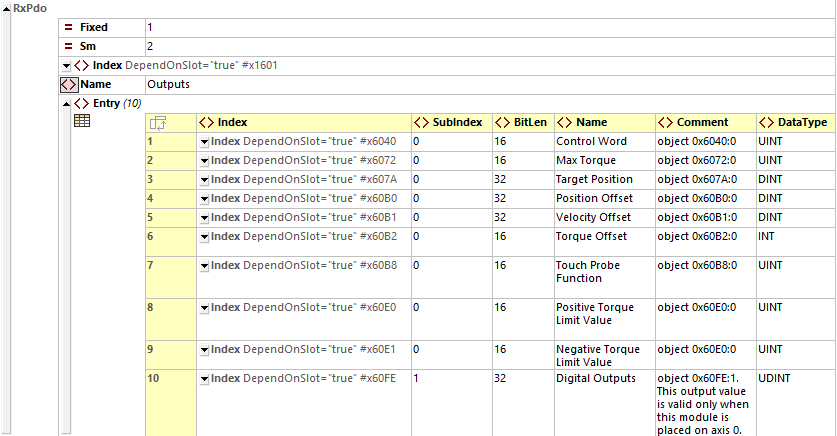
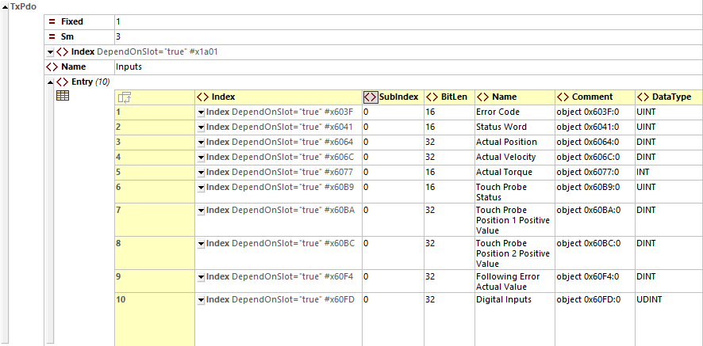
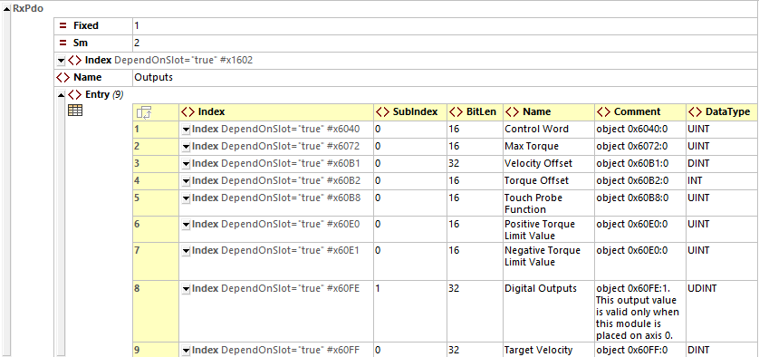
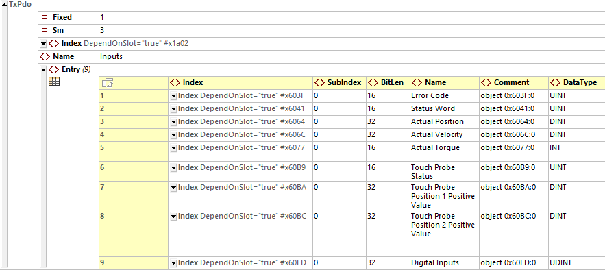
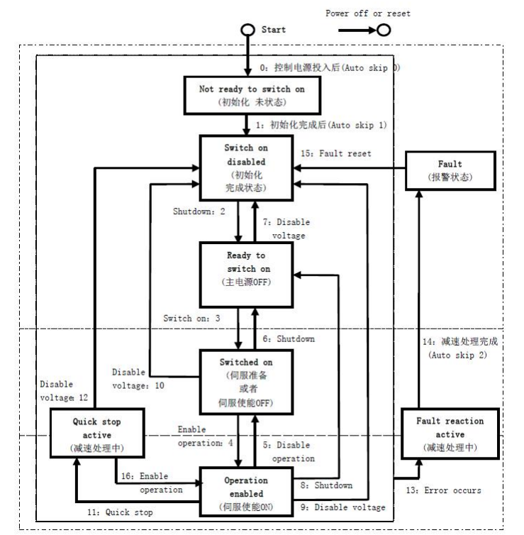
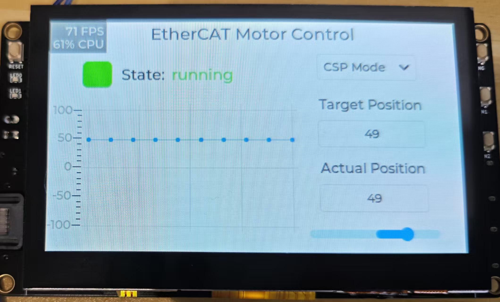
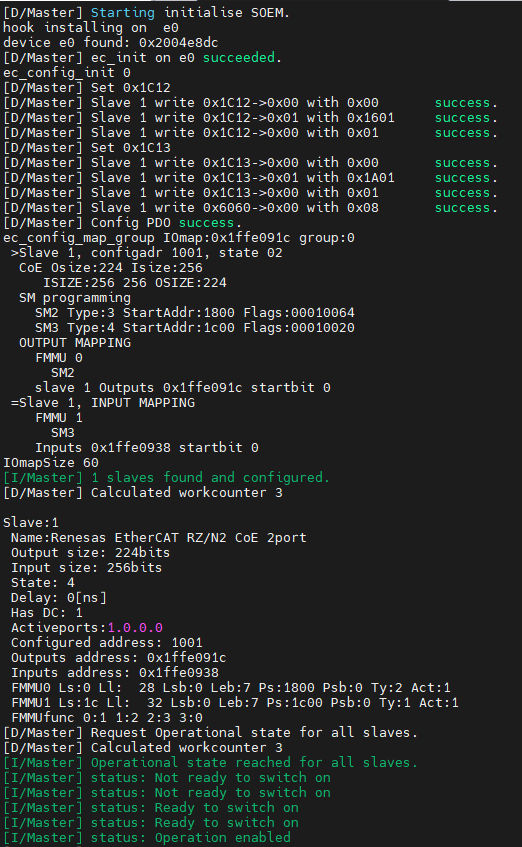

# RA6M3-HMI-Board EtherCAT主站例程

本例程使用SOEM软件包实现了EtherCAT主站，并结合LVGL设计了图形化界面来控制从站的电机。

## 简介

**SOEM（Simple Open EtherCAT Master**）是由 EtherCAT 技术用户组织（ETG）下属开源社区发布的一个轻量级、跨平台的 EtherCAT 主站协议栈。它用纯 C 编写，设计目标是尽可能小、可移植、可嵌入，适合在实时或资源受限的系统中运行。

**核心特点**

| 特性       | 描述                                           |
| ---------- | ---------------------------------------------- |
| 开源且免费 | 采用 GPLv2 协议，可自由修改和分发              |
| 跨平台     | 支持 Linux、Windows、RTOS、裸机系统等          |
| 实时性好   | 无需内核模块，纯用户态实现，适合周期性实时控制 |
| 功能完整   | 支持从站配置、PDO 映射、DC 同步、CoE、FoE      |
| 易于移植   | 提供简洁的网卡和操作系统抽象层，便于适配平台   |

**支持功能一览**

| 功能                     | 支持情况  |
| ------------------------ | --------- |
| 从站扫描与识别（EEPROM） | ✅         |
| 自动分配地址（AIA）      | ✅         |
| CoE / FoE / EoE          | ✅（部分） |
| PDO 映射（静态/动态）    | ✅         |
| 分布式时钟（DC）同步     | ✅         |
| 实时数据通信             | ✅         |

## PDO数据

测试时使用的从站是EtherKit的CoE例程，根据Etherkit从站的ESI文件来设置PDO数据映射。

**同步周期位置模式：**

RxPdo



TxPdo



```c
typedef struct PACKED{
    uint16 ControlWord;
    uint16 MaxTorque;
    int32 TargetPosition;
    int32 PositionOffset;
    int32 VelocityOffset;
    int16 TorqueOffset;
    uint16 TouchProbeFunction;
    uint16 PositiveTorqueLimitValue;
    uint16 NegativeTorqueLimitValue;
    uint32 DigitalOutputs;
} CSP_Output;

typedef struct PACKED{
    uint16 ErrorCode;
    uint16 StatusWord;
    int32 ActualPosition;
    int32 ActualVelocity;
    int16 ActualTorque;
    uint16 TouchProbeStatus;
    int32 TouchProbePosition1PositiveValue;
    int32 TouchProbePosition2PositiveValue;
    int32 FollowingErrorActualValue;
    uint32 DigitalInputs;
} CSP_Input;
```

**同步周期速度模式**：

RxPdo



TxPdo



```c
typedef struct PACKED{
    uint16 ControlWord;
    uint16 MaxTorque;
    int32 VelocityOffset;
    int16 TorqueOffset;
    uint16 TouchProbeFunction;
    uint16 PositiveTorqueLimitValue;
    uint16 NegativeTorqueLimitValue;
    uint32 DigitalOutputs;
    int32 TargetVelocity;
} CSV_Output;

typedef struct PACKED{
    uint16 ErrorCode;
    uint16 StatusWord;
    int32 ActualPosition;
    int32 ActualVelocity;
    int16 ActualTorque;
    uint16 TouchProbeStatus;
    int32 TouchProbePosition1PositiveValue;
    int32 TouchProbePosition2PositiveValue;
    uint32 DigitalInputs;
} CSV_Input;
```

 ## 状态切换

**从站的CiA402状态**



主站根据状态机编写状态切换函数。

```c
void ec_switch_op()
{
    do
    {
        if (mode == 0)
            cur_status = csp_inputs->StatusWord;
        else if (mode == 1)
            cur_status = csv_inputs->StatusWord;
        switch (cur_status & 0x006F)
        {
        case 0x0027:
            LOG_I("status: Operation enabled");
            if (mode == 0)
            {
                csp_outputs->ControlWord = 0x001F;
                csp_outputs->TargetPosition = 0;
            }
            else if (mode == 1)
                csv_outputs->TargetVelocity = 2;
            break;
        case 0x0000:
            LOG_I("status: Not ready to switch on");
            break;
        case 0x0040:
            LOG_I("status: Switched on but disabled");
            OUTPUT(ControlWord, 0x0006); //切换到ReadyToSwitchOn
            break;
        case 0x0021:
            LOG_I("status: Ready to switch on");
            OUTPUT(ControlWord, 0x0007); //切换到SwitchOn
            break;
        case 0x0023:
            LOG_I("status: Switched on");
            OUTPUT(ControlWord, 0x000F); //切换到OperationalEnable
            break;
        case 0x0008:
            LOG_I("status: Fault state");
            OUTPUT(ControlWord, 0x0080); //故障复位
            break;
        case 0x0007:
            LOG_I("status: Quickstop active");

            break;
        case 0x000F:
            LOG_I("status: Fault reaction active");

            break;
        default:
            LOG_E("Unhandled state: 0x%04X", cur_status & 0x006F);
            break;
        }
        ec_send_processdata();
        wkc = ec_receive_processdata(EC_TIMEOUTRET);

        rt_thread_mdelay(2);
    }while ((cur_status & 0x006F) != 0x0027);
}
```

## EtherCAT主站通信流程

主站基于SOEM协议栈实现，典型EtherCAT通信流程如下：

**初始化网卡：**

```c
ec_init("e0"); // 初始化指定网卡（支持 raw socket）
```

**扫描并配置从站：**

```c
ec_config_init(FALSE);
ec_config_map(&IOmap);  // 映射 PDO 数据区
```

**分布式时钟同步：**

```c
ec_configdc();  // DC 同步配置
```

**启用从站、设置状态：**

```c
ec_slave[0].state = EC_STATE_OPERATIONAL;
ec_writestate(0);
```

**循环发送/接收帧：**

```c
while (1) {
    ec_send_processdata();
    ec_receive_processdata(EC_TIMEOUTRET);
    // 实时控制处理
}
```

## 效果图

LVGL图形界面



终端输出


