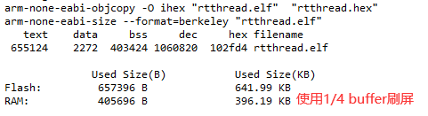
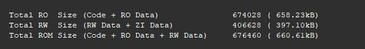

* 主频：120 MHZ
* Memory：2-MB code flash、64-KB data flash，SRAM：640KB
* 运行 Demo：lv_music_demo
* 编译工具链：arm-none-eabi-gcc v10.2.1
* 编译优化等级：OS
* 使能外设：Lcd（RGB565），g2d，uartx1，i2cx1，gpio
* LVGL推屏RAM占用：（480*272/4）
* 资源消耗总计：Flash（消耗：641.99 KB，剩余：1406 KB），RAM（消耗：396.19 KB，剩余：244 KB）

* 编译工具链：armclag v6.19
* 编译优化等级：OS
* 资源消耗总计：Flash（消耗：660.61kB，剩余：1388 KB），RAM（消耗：397.10 kB，剩余：243 KB）

