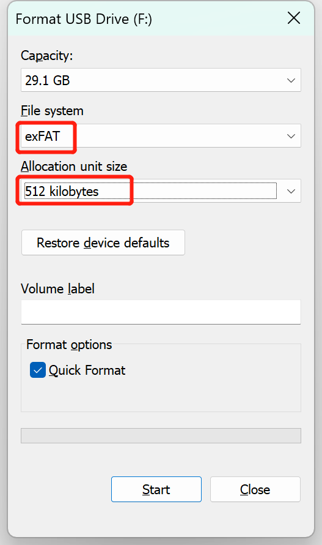

# HMI-Board Video Demo User Guide

[中文](README_ZH.md)|English

## How to Connect Your Hardware

- Pop the SD card into the slot on the back of the dev board
- Plug your speaker into the audio jack on the back of the dev board

## Formatting Your SD Card

We used the `DiskGenius` tool to format the SD card. Just a heads up: make sure to format the card with a sector size of 512 bytes.

## How to Use the HMI-Board-Video Demo

1. Grab an 8GB SD card and load it up with your video files.
2. Pop the SD card into the SD card slot.
3. Hook up the RGB screen.
4. Flash the firmware.
5. Power it up and watch as the screen cycles through and plays your videos.
6. Use the up and down buttons on the UI to switch between videos. Adjust the volume with the slider on the left (slide up to crank it up, slide down to turn it down).
