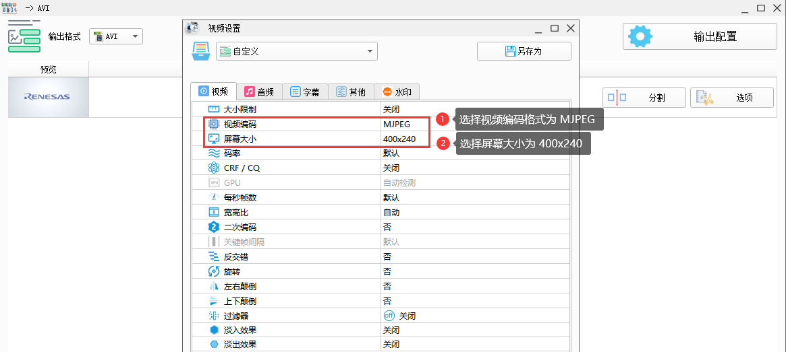
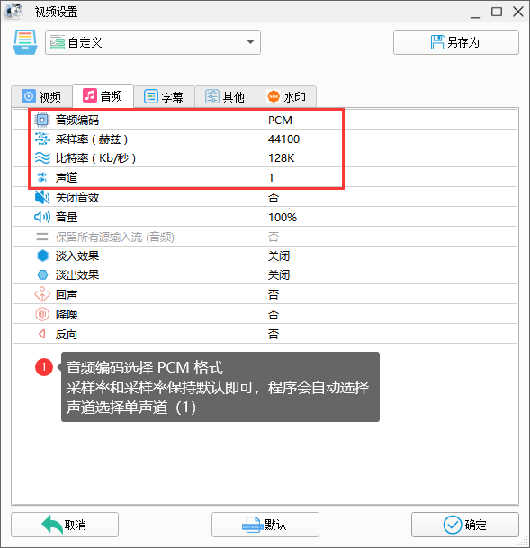

# HMI-Board Video Demo 上手指南

## 硬件连接方式

* 将 SD 卡插入开发板背面卡槽
* 将喇叭插入开发板背面音频输出接口

## SD卡格式化

这里我使用 `DiskGenius` 工具进行 SD卡格式化，值得注意的是：SD卡需要使用 512 Byte 大小格式化扇区。


## 视频制作方式

这里我使用 [格式工厂](http://down.pcgeshi.com/FormatFactory_setup.exe) 软件进行视频转码处理，具体使用方式如下：


* 视频配置选项：



* 音频配置选项：



* 配置选择好并选择指定的输出路径后，点击确定。最后点击开始转码即可完成视频转换步骤

  

* 视频转换成功后，将其后缀名为 .avi 的视频存放到 sdcard 中即可

## HMI-Board-Video Demo 使用方式

1. 准备一张 8GB SDCard，拷贝视频资源到存储卡
2. 将 SDCard 插入 SD 卡接口
3. 连接 RGB 屏幕
4. 烧录固件
5. 正常运行上电屏幕上会便会循环遍历播放文件系统中的视频文件
6. 使用 UI 的上下按键可以切换上/下一个视频资源，使用左侧的滑条可以调节音量大小（向上滑动+，向下滑动-）

## 使用说明

- 本 SDK 可以从 studio 的 SDK 管理界面直接下载，并基于本 SDK 新建工程。

- 本 SDK 同时提供 MDK5 工程。下面以 MDK5 开发环境为例，介绍如何将系统运行起来。

**编译下载**

- 首先双击 mklinks.bat ，然后打开 env 执行 `scons --target=mdk5` 生成新的 mdk5 工程

  > **注意**：若电脑没管理员权限点击不了mklinks.bat，则需要手动将 sdk-bsp-ra6m3-hmi-board1目录下的 rt-thread 和 libraries 文件夹拷贝到当前工程目录下

- 编译：双击 project.uvprojx 文件，打开 MDK5 工程，编译程序。（注意 AC6 版本可选 6.14、6.16、6.19，勿选择 6.15 版本编译）

- 下载：点击 MDK 的 download/Debug 按钮进行下载调试

**查看运行结果**

下载程序成功之后，系统会自动运行并打印系统信息。

连接开发板对应串口到 PC , 在终端工具里打开相应的串口（115200-8-1-N），复位设备后，可以看到 RT-Thread 的输出信息。输入 help 命令可查看系统中支持的命令。

```bash
 \ | /
- RT -     Thread Operating System
 / | \     5.0.0 build Jan  4 2023 10:14:56
 2006 - 2022 Copyright by RT-Thread team
Hello RT-Thread!
msh >
msh >help
help             - RT-Thread shell help.
ps               - List threads in the system.
free             - Show the memory usage in the system.
clear            - clear the terminal screen
version          - show RT-Thread version information
list             - list objects

msh > 
```

**应用入口函数**

应用层的入口函数在 **sdk-bsp-ra6m3-hmi-board\projects\hmi-board-lvgl\src\hal_entry.c** 中 的 `void hal_entry(void)` 。用户编写的源文件可直接放在 src 目录下。

```c
void hal_entry(void)
{
    rt_kprintf("\nHello RT-Thread!\n");

    while (1)
    {
        rt_pin_write(LED3_PIN, PIN_HIGH);
        rt_thread_mdelay(500);
        rt_pin_write(LED3_PIN, PIN_LOW);
        rt_thread_mdelay(500);
    }
}
```

## 联系人信息

在使用过程中若您有任何的想法和建议，建议您通过以下方式来联系到我们  [RT-Thread 社区论坛](https://club.rt-thread.org/)

## SDK 仓库

这是 HMI-Board 的 SDK 仓库地址：[sdk-bsp-ra6m3-hmi-board](https://github.com/RT-Thread-Studio/sdk-bsp-ra6m3-hmi-board)，该仓库包括了外设驱动以及丰富的示例工程，如果像体验官网/社区提供的开源示例请转移到该仓库进行开发。RT-Thread 主仓库只维护最新的驱动相关代码。

## 贡献代码

如果您对  RA6M3-HMI-Board 感兴趣，并且有一些好玩的项目愿意与大家分享的话欢迎给我们贡献代码，您可以参考 [如何向 RT-Thread 代码贡献](https://www.rt-thread.org/document/site/#/rt-thread-version/rt-thread-standard/development-guide/github/github)。

## 资料及文档

用户如果希望自行移植 LVGL，可以在 RT-Thread 文档中心查看移植相关文档和视频教程：

- [LVGL的对接与移植](https://www.rt-thread.org/document/site/#/rt-thread-version/rt-thread-standard/packages-manual/lvgl-docs/introduction)

如要进行 LVGL UI 开发可以前往 LVGL 官网以及文档中心获取详细资料：

- [LVGL - Light and Versatile Embedded Graphics Library](https://lvgl.io/)

- [LVGL documentation](https://docs.lvgl.io/8.3/)

